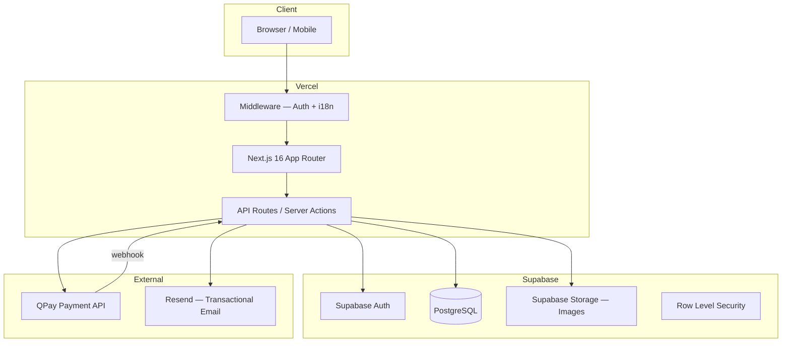
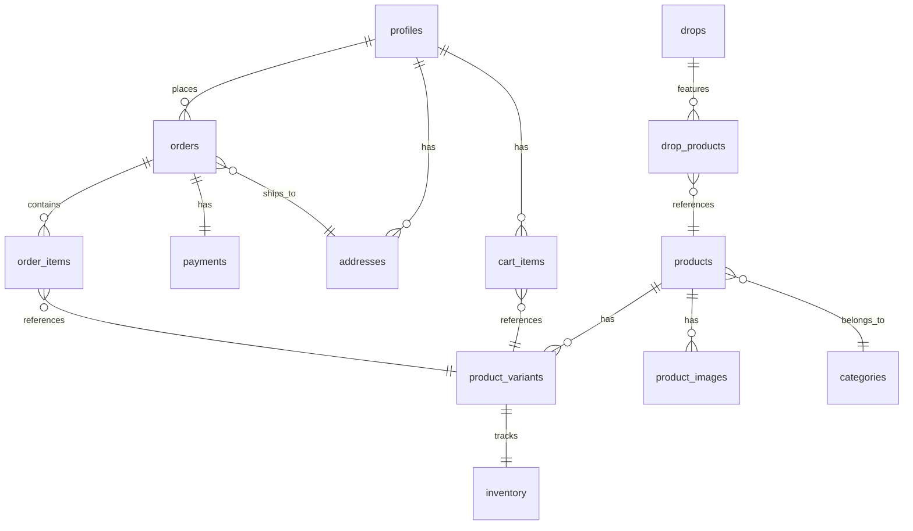
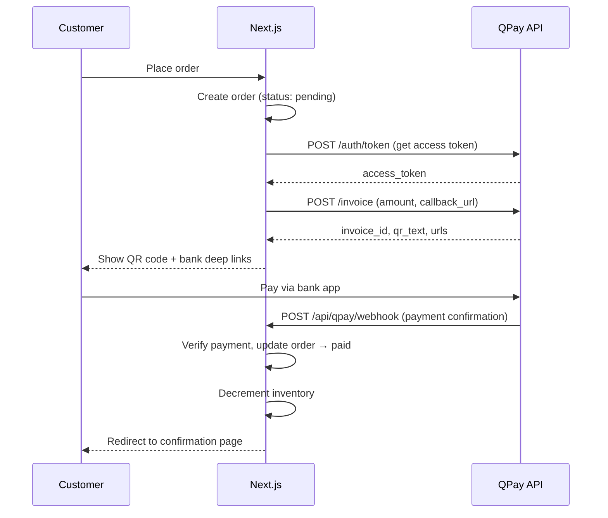

# Heir — E-Commerce Platform PRD

> Single source of truth for the Heir e-commerce platform.
> Last updated: 2026-02-22

---

## 1. Project Overview

**Heir** (@heir.rchive) is a Mongolian men's fashion brand with an "old money" aesthetic and budget-friendly pricing (50,000–200,000₮). This document covers the full-stack e-commerce platform that powers the brand's online store.

### Target Audience

- Mongolian men aged 18–35
- Style-conscious, budget-aware
- Mobile-first shoppers (Instagram-driven traffic)

### Requirements Summary

| Area                  | Decision                                                |
| --------------------- | ------------------------------------------------------- |
| **Product type**      | Physical products                                       |
| **Vendor model**      | Single vendor                                           |
| **Customer accounts** | Required to checkout                                    |
| **Auth**              | Email + password + Google OAuth                         |
| **Payment**           | QPay (Mongolia)                                         |
| **Tech stack**        | Next.js 16, React 19, Supabase, Tailwind v4            |
| **Inventory**         | Full (stock tracking, low-stock alerts)                 |
| **Shipping**          | Handled outside website (contract-based)                |
| **Admin**             | Full dashboard (products, orders, customers, analytics) |
| **Currency**          | MNT (₮)                                                |
| **Languages**         | Mongolian (primary) + English                           |
| **Hosting**           | Vercel                                                  |

### Architecture Diagram



---

## 2. Tech Stack

| Layer        | Technology                                    |
| ------------ | --------------------------------------------- |
| Framework    | Next.js 16 (App Router, `src/` directory)     |
| UI           | React 19, Tailwind CSS v4                     |
| Language     | TypeScript 5                                  |
| Database     | Supabase PostgreSQL                           |
| Auth         | Supabase Auth (email + Google OAuth)          |
| Payments     | QPay API (MNT)                                |
| i18n         | next-intl (`/[locale]/` URL prefix)           |
| Hosting      | Vercel                                        |
| Email        | Resend (order confirmation, password reset)   |
| Validation   | Zod + React Hook Form                         |
| Icons        | Lucide React                                  |
| Utilities    | clsx, tailwind-merge                          |

### Dependencies to Install

```bash
npm install @supabase/supabase-js @supabase/ssr next-intl react-hook-form zod clsx tailwind-merge lucide-react resend
```

---

## 3. User Roles

### Customer

- Browse products and collections
- Search and filter by category, size, price
- Add to cart, checkout via QPay
- Create account, manage profile
- View order history and status
- Manage saved addresses

### Admin

- Full product CRUD (name, description, variants, images, pricing)
- Order management (view, update status, cancel)
- Inventory tracking with low-stock alerts
- Customer list and order history lookup
- Drops management (schedule, activate, deactivate)
- Basic analytics (revenue, orders, top products)
- Site settings (shipping fees, announcement bar)

---

## 4. Page Map

### Public Pages

| Route                          | Page              | Description                                          |
| ------------------------------ | ----------------- | ---------------------------------------------------- |
| `/`                            | Landing           | Hero, featured products, collections, care guide     |
| `/store`                       | Store             | Product grid with filters (category, size, price)    |
| `/store/[slug]`                | Product Detail    | Images, variants, size guide, add to cart            |
| `/collections`                 | Collections       | All collections grid                                 |
| `/collections/[slug]`          | Collection Detail | Filtered product grid for one collection             |
| `/cart`                        | Cart              | Cart items, quantities, subtotal                     |
| `/drops`                       | Drops             | Upcoming and active limited drops                    |
| `/drops/[slug]`                | Drop Detail       | Countdown, products in the drop                      |
| `/about`                       | About             | Brand story, values                                  |
| `/care`                        | Care Guide        | Garment care instructions                            |

### Auth Pages

| Route                          | Page              | Description                                          |
| ------------------------------ | ----------------- | ---------------------------------------------------- |
| `/login`                       | Login             | Email/password + Google OAuth                        |
| `/register`                    | Register          | Create account                                       |
| `/forgot-password`             | Forgot Password   | Password reset email                                 |
| `/auth/callback`               | OAuth Callback    | Supabase OAuth redirect handler                      |

### Protected Pages (requires login)

| Route                          | Page              | Description                                          |
| ------------------------------ | ----------------- | ---------------------------------------------------- |
| `/checkout`                    | Checkout Address  | Shipping address form                                |
| `/checkout/payment`            | Checkout Payment  | QPay QR code / invoice                               |
| `/checkout/confirmation`       | Confirmation      | Order success, summary                               |
| `/account`                     | Account Overview  | Profile summary, recent orders                       |
| `/account/orders`              | Order History     | All past orders                                      |
| `/account/orders/[id]`         | Order Detail      | Single order status and items                        |
| `/account/addresses`           | Addresses         | Saved address CRUD                                   |
| `/account/profile`             | Profile           | Edit name, email, phone, password                    |

### Admin Pages (requires admin role)

| Route                          | Page              | Description                                          |
| ------------------------------ | ----------------- | ---------------------------------------------------- |
| `/admin`                       | Dashboard         | Revenue, orders today, low stock summary             |
| `/admin/products`              | Products List     | All products table with search                       |
| `/admin/products/new`          | New Product       | Create product form                                  |
| `/admin/products/[id]`         | Edit Product      | Edit product + variants + images                     |
| `/admin/orders`                | Orders List       | All orders, filter by status                         |
| `/admin/orders/[id]`           | Order Detail      | Order info, update status                            |
| `/admin/customers`             | Customers List    | Customer table                                       |
| `/admin/inventory`             | Inventory         | Stock levels, low-stock alerts                       |
| `/admin/drops`                 | Drops Management  | Create/edit/schedule drops                           |
| `/admin/analytics`             | Analytics         | Revenue charts, top products, order trends           |
| `/admin/settings`              | Settings          | Shipping fees, announcement bar, site config         |

---

## 5. Data Model (Supabase PostgreSQL)

### Schema Diagram



### Tables

#### `profiles`

Extends Supabase `auth.users`. Created via trigger on signup.

```sql
CREATE TABLE profiles (
  id UUID PRIMARY KEY REFERENCES auth.users(id) ON DELETE CASCADE,
  ovog TEXT,                    -- Овог (surname)
  ner TEXT,                     -- Нэр (given name)
  phone TEXT,                   -- +976 format
  role TEXT DEFAULT 'customer' CHECK (role IN ('customer', 'admin')),
  locale TEXT DEFAULT 'mn',
  created_at TIMESTAMPTZ DEFAULT now(),
  updated_at TIMESTAMPTZ DEFAULT now()
);
```

#### `categories`

```sql
CREATE TABLE categories (
  id UUID PRIMARY KEY DEFAULT gen_random_uuid(),
  slug TEXT UNIQUE NOT NULL,
  name_mn TEXT NOT NULL,        -- Монгол нэр
  name_en TEXT NOT NULL,
  sort_order INT DEFAULT 0,
  created_at TIMESTAMPTZ DEFAULT now()
);
```

Seed categories:
- `Цамц` / Shirts
- `Өмд` / Pants
- `Хүрэм` / Jackets
- `Цүнх` / Bags
- `Дагавар` / Accessories

#### `products`

```sql
CREATE TABLE products (
  id UUID PRIMARY KEY DEFAULT gen_random_uuid(),
  slug TEXT UNIQUE NOT NULL,
  category_id UUID REFERENCES categories(id),
  name_mn TEXT NOT NULL,
  name_en TEXT NOT NULL,
  description_mn TEXT,
  description_en TEXT,
  base_price INT NOT NULL,      -- MNT, stored as integer (e.g. 89000)
  is_active BOOLEAN DEFAULT true,
  is_featured BOOLEAN DEFAULT false,
  created_at TIMESTAMPTZ DEFAULT now(),
  updated_at TIMESTAMPTZ DEFAULT now()
);
```

#### `product_variants`

```sql
CREATE TABLE product_variants (
  id UUID PRIMARY KEY DEFAULT gen_random_uuid(),
  product_id UUID REFERENCES products(id) ON DELETE CASCADE,
  size TEXT NOT NULL,            -- S, M, L, XL, XXL
  color_name_mn TEXT,
  color_name_en TEXT,
  color_hex TEXT,                -- e.g. #1a1a1a
  price_override INT,           -- NULL = use base_price
  sku TEXT UNIQUE,
  created_at TIMESTAMPTZ DEFAULT now()
);
```

#### `product_images`

```sql
CREATE TABLE product_images (
  id UUID PRIMARY KEY DEFAULT gen_random_uuid(),
  product_id UUID REFERENCES products(id) ON DELETE CASCADE,
  url TEXT NOT NULL,             -- Supabase Storage URL
  alt_text TEXT,
  sort_order INT DEFAULT 0,
  is_primary BOOLEAN DEFAULT false
);
```

#### `inventory`

```sql
CREATE TABLE inventory (
  id UUID PRIMARY KEY DEFAULT gen_random_uuid(),
  variant_id UUID UNIQUE REFERENCES product_variants(id) ON DELETE CASCADE,
  quantity INT NOT NULL DEFAULT 0,
  low_stock_threshold INT DEFAULT 3,
  updated_at TIMESTAMPTZ DEFAULT now()
);
```

#### `addresses`

```sql
CREATE TABLE addresses (
  id UUID PRIMARY KEY DEFAULT gen_random_uuid(),
  user_id UUID REFERENCES profiles(id) ON DELETE CASCADE,
  label TEXT DEFAULT 'home',    -- home, work, other
  ovog TEXT NOT NULL,
  ner TEXT NOT NULL,
  phone TEXT NOT NULL,
  city TEXT DEFAULT 'Улаанбаатар',
  district TEXT NOT NULL,       -- Дүүрэг (e.g. Баянгол, Хан-Уул)
  khoroo TEXT NOT NULL,         -- Хороо (e.g. 1-р хороо)
  address_line TEXT NOT NULL,   -- Байр, тоот (building, apt)
  is_default BOOLEAN DEFAULT false,
  created_at TIMESTAMPTZ DEFAULT now()
);
```

#### `orders`

```sql
CREATE TABLE orders (
  id UUID PRIMARY KEY DEFAULT gen_random_uuid(),
  user_id UUID REFERENCES profiles(id),
  address_id UUID REFERENCES addresses(id),
  status TEXT DEFAULT 'pending' CHECK (status IN (
    'pending', 'paid', 'processing', 'shipped', 'delivered', 'cancelled'
  )),
  subtotal INT NOT NULL,
  shipping_fee INT DEFAULT 0,
  total INT NOT NULL,
  notes TEXT,
  created_at TIMESTAMPTZ DEFAULT now(),
  updated_at TIMESTAMPTZ DEFAULT now()
);
```

#### `order_items`

```sql
CREATE TABLE order_items (
  id UUID PRIMARY KEY DEFAULT gen_random_uuid(),
  order_id UUID REFERENCES orders(id) ON DELETE CASCADE,
  variant_id UUID REFERENCES product_variants(id),
  product_name TEXT NOT NULL,   -- Snapshot at order time
  size TEXT NOT NULL,
  color TEXT,
  quantity INT NOT NULL,
  unit_price INT NOT NULL,      -- Price at order time
  created_at TIMESTAMPTZ DEFAULT now()
);
```

#### `payments`

```sql
CREATE TABLE payments (
  id UUID PRIMARY KEY DEFAULT gen_random_uuid(),
  order_id UUID UNIQUE REFERENCES orders(id) ON DELETE CASCADE,
  qpay_invoice_id TEXT,
  qpay_payment_id TEXT,
  amount INT NOT NULL,
  status TEXT DEFAULT 'pending' CHECK (status IN ('pending', 'paid', 'failed', 'refunded')),
  paid_at TIMESTAMPTZ,
  raw_response JSONB,           -- Full QPay response for debugging
  created_at TIMESTAMPTZ DEFAULT now()
);
```

#### `cart_items`

```sql
CREATE TABLE cart_items (
  id UUID PRIMARY KEY DEFAULT gen_random_uuid(),
  user_id UUID REFERENCES profiles(id) ON DELETE CASCADE,
  variant_id UUID REFERENCES product_variants(id) ON DELETE CASCADE,
  quantity INT NOT NULL DEFAULT 1,
  created_at TIMESTAMPTZ DEFAULT now(),
  UNIQUE (user_id, variant_id)
);
```

#### `drops` + `drop_products`

```sql
CREATE TABLE drops (
  id UUID PRIMARY KEY DEFAULT gen_random_uuid(),
  slug TEXT UNIQUE NOT NULL,
  title_mn TEXT NOT NULL,
  title_en TEXT NOT NULL,
  description_mn TEXT,
  description_en TEXT,
  image_url TEXT,
  starts_at TIMESTAMPTZ NOT NULL,
  ends_at TIMESTAMPTZ,
  is_active BOOLEAN DEFAULT false,
  created_at TIMESTAMPTZ DEFAULT now()
);

CREATE TABLE drop_products (
  drop_id UUID REFERENCES drops(id) ON DELETE CASCADE,
  product_id UUID REFERENCES products(id) ON DELETE CASCADE,
  sort_order INT DEFAULT 0,
  PRIMARY KEY (drop_id, product_id)
);
```

### Row Level Security (RLS) Summary

| Table              | Customer                          | Admin     |
| ------------------ | --------------------------------- | --------- |
| `profiles`         | Read/update own row               | Read all  |
| `categories`       | Read all                          | Full CRUD |
| `products`         | Read active only                  | Full CRUD |
| `product_variants` | Read (via active product)         | Full CRUD |
| `product_images`   | Read (via active product)         | Full CRUD |
| `inventory`        | No direct access                  | Full CRUD |
| `addresses`        | Own rows only                     | Read all  |
| `orders`           | Own rows only                     | Full CRUD |
| `order_items`      | Own order items only              | Read all  |
| `payments`         | Own payment status only           | Read all  |
| `cart_items`       | Own rows only                     | No access |
| `drops`            | Read active only                  | Full CRUD |

---

## 6. Component Architecture

```
src/components/
├── ui/                       # Reusable primitives
│   ├── Button.tsx
│   ├── Input.tsx
│   ├── Select.tsx
│   ├── Badge.tsx
│   ├── Modal.tsx
│   ├── Spinner.tsx
│   ├── Toast.tsx
│   └── Skeleton.tsx
├── layout/
│   ├── Header.tsx            # Nav, logo, cart icon, lang switcher
│   ├── Footer.tsx
│   ├── MobileMenu.tsx
│   ├── AnnouncementBar.tsx
│   └── AdminSidebar.tsx
├── product/
│   ├── ProductCard.tsx       # Grid card (image, name, price, swatches)
│   ├── ProductGrid.tsx       # Responsive grid with loading states
│   ├── ProductGallery.tsx    # Image carousel on detail page
│   ├── VariantSelector.tsx   # Size + color picker
│   ├── SizeGuide.tsx
│   └── ProductFilters.tsx    # Category, size, price range
├── cart/
│   ├── CartDrawer.tsx        # Slide-out cart
│   ├── CartItem.tsx
│   └── CartSummary.tsx
├── checkout/
│   ├── AddressForm.tsx       # Mongolian address fields
│   ├── QPayPayment.tsx       # QR code display + polling
│   └── OrderSummary.tsx
├── account/
│   ├── OrderList.tsx
│   ├── OrderStatusBadge.tsx
│   ├── AddressList.tsx
│   └── ProfileForm.tsx
├── admin/
│   ├── ProductForm.tsx       # Create/edit product
│   ├── VariantManager.tsx    # Add/edit/remove variants
│   ├── ImageUploader.tsx     # Drag-drop to Supabase Storage
│   ├── OrderTable.tsx
│   ├── CustomerTable.tsx
│   ├── InventoryTable.tsx
│   ├── DropForm.tsx
│   ├── StatsCard.tsx
│   └── RevenueChart.tsx
└── i18n/
    ├── LanguageSwitcher.tsx
    └── LocaleProvider.tsx
```

---

## 7. i18n Strategy

### Setup: next-intl with URL Prefix

- URL pattern: `/mn/store`, `/en/store`
- Mongolian is the default locale
- Middleware detects locale from URL prefix, falls back to `mn`

### Translation File Structure

```
src/messages/
├── mn.json
└── en.json
```

### Sample Translation Keys

```json
{
  "common": {
    "shop": "Дэлгүүр",
    "cart": "Сагс",
    "login": "Нэвтрэх",
    "register": "Бүртгүүлэх",
    "search": "Хайх",
    "logout": "Гарах"
  },
  "product": {
    "addToCart": "Сагсанд нэмэх",
    "size": "Размер",
    "color": "Өнгө",
    "inStock": "Байгаа",
    "outOfStock": "Дууссан",
    "price": "Үнэ"
  },
  "checkout": {
    "shippingAddress": "Хүргэлтийн хаяг",
    "district": "Дүүрэг",
    "khoroo": "Хороо",
    "building": "Байр, тоот",
    "phone": "Утасны дугаар",
    "placeOrder": "Захиалга өгөх",
    "payWithQPay": "QPay-ээр төлөх"
  },
  "account": {
    "myOrders": "Миний захиалга",
    "addresses": "Хаягууд",
    "profile": "Профайл"
  },
  "categories": {
    "shirts": "Цамц",
    "pants": "Өмд",
    "jackets": "Хүрэм",
    "bags": "Цүнх",
    "accessories": "Дагавар"
  },
  "orderStatus": {
    "pending": "Хүлээгдэж буй",
    "paid": "Төлөгдсөн",
    "processing": "Бэлтгэж буй",
    "shipped": "Илгээсэн",
    "delivered": "Хүргэсэн",
    "cancelled": "Цуцлагдсан"
  }
}
```

---

## 8. QPay Integration

### Payment Flow



### API Routes

| Route                     | Method | Purpose                                |
| ------------------------- | ------ | -------------------------------------- |
| `/api/qpay/create-invoice`| POST   | Create QPay invoice for an order       |
| `/api/qpay/webhook`       | POST   | Receive payment confirmation from QPay |
| `/api/qpay/check/[id]`   | GET    | Manual payment status check (polling)  |

### Token Management

- QPay access tokens expire after a set period
- Store token + expiry in memory or environment
- Refresh automatically before making API calls

---

## 9. Authentication

### Supabase Auth Setup

- **Email + password** — primary method
- **Google OAuth** — social login
- Supabase handles sessions, tokens, and refresh automatically via `@supabase/ssr`

### Middleware (`src/middleware.ts`)

```
1. Parse locale from URL → set next-intl locale
2. Read Supabase session from cookies
3. Protected routes (/checkout/*, /account/*) → redirect to /login if no session
4. Admin routes (/admin/*) → check profiles.role = 'admin', redirect to / if not
```

### Profile Creation Trigger

A Supabase database trigger creates a `profiles` row when a new `auth.users` row is inserted:

```sql
CREATE OR REPLACE FUNCTION handle_new_user()
RETURNS TRIGGER AS $$
BEGIN
  INSERT INTO profiles (id, ner, ovog)
  VALUES (
    NEW.id,
    COALESCE(NEW.raw_user_meta_data->>'given_name', ''),
    COALESCE(NEW.raw_user_meta_data->>'family_name', '')
  );
  RETURN NEW;
END;
$$ LANGUAGE plpgsql SECURITY DEFINER;

CREATE TRIGGER on_auth_user_created
  AFTER INSERT ON auth.users
  FOR EACH ROW
  EXECUTE FUNCTION handle_new_user();
```

---

## 10. File / Folder Structure

```
src/
├── app/
│   ├── [locale]/
│   │   ├── layout.tsx              # Root layout with Header/Footer
│   │   ├── page.tsx                # Landing page
│   │   ├── store/
│   │   │   ├── page.tsx            # Product listing
│   │   │   └── [slug]/
│   │   │       └── page.tsx        # Product detail
│   │   ├── collections/
│   │   │   ├── page.tsx
│   │   │   └── [slug]/
│   │   │       └── page.tsx
│   │   ├── cart/
│   │   │   └── page.tsx
│   │   ├── drops/
│   │   │   ├── page.tsx
│   │   │   └── [slug]/
│   │   │       └── page.tsx
│   │   ├── about/
│   │   │   └── page.tsx
│   │   ├── care/
│   │   │   └── page.tsx
│   │   ├── login/
│   │   │   └── page.tsx
│   │   ├── register/
│   │   │   └── page.tsx
│   │   ├── forgot-password/
│   │   │   └── page.tsx
│   │   ├── checkout/
│   │   │   ├── page.tsx            # Address step
│   │   │   ├── payment/
│   │   │   │   └── page.tsx
│   │   │   └── confirmation/
│   │   │       └── page.tsx
│   │   ├── account/
│   │   │   ├── page.tsx
│   │   │   ├── orders/
│   │   │   │   ├── page.tsx
│   │   │   │   └── [id]/
│   │   │   │       └── page.tsx
│   │   │   ├── addresses/
│   │   │   │   └── page.tsx
│   │   │   └── profile/
│   │   │       └── page.tsx
│   │   └── admin/
│   │       ├── layout.tsx          # Admin layout with sidebar
│   │       ├── page.tsx            # Dashboard
│   │       ├── products/
│   │       │   ├── page.tsx
│   │       │   ├── new/
│   │       │   │   └── page.tsx
│   │       │   └── [id]/
│   │       │       └── page.tsx
│   │       ├── orders/
│   │       │   ├── page.tsx
│   │       │   └── [id]/
│   │       │       └── page.tsx
│   │       ├── customers/
│   │       │   └── page.tsx
│   │       ├── inventory/
│   │       │   └── page.tsx
│   │       ├── drops/
│   │       │   └── page.tsx
│   │       ├── analytics/
│   │       │   └── page.tsx
│   │       └── settings/
│   │           └── page.tsx
│   ├── auth/
│   │   └── callback/
│   │       └── route.ts            # OAuth callback handler
│   └── api/
│       └── qpay/
│           ├── create-invoice/
│           │   └── route.ts
│           ├── webhook/
│           │   └── route.ts
│           └── check/
│               └── [id]/
│                   └── route.ts
├── components/                     # See Section 6
├── lib/
│   ├── supabase/
│   │   ├── client.ts               # Browser client
│   │   ├── server.ts               # Server client (cookies)
│   │   └── admin.ts                # Service role client
│   ├── qpay.ts                     # QPay API helpers
│   ├── utils.ts                    # cn(), formatPrice(), etc.
│   └── validators.ts               # Zod schemas
├── messages/
│   ├── mn.json
│   └── en.json
├── middleware.ts                    # Auth + i18n middleware
└── globals.css                     # Tailwind v4 config (@theme inline)
```

---

## 11. Implementation Phases

### Phase 1 — MVP (Weeks 1–4)

| Week | Deliverables                                                    |
| ---- | --------------------------------------------------------------- |
| 1    | Supabase setup (schema, RLS, triggers), Auth (login, register, Google OAuth), i18n scaffolding |
| 2    | Store page (product grid, filters), Product detail page (gallery, variants, add to cart) |
| 3    | Cart (drawer + page), Checkout flow (address form, order creation) |
| 4    | QPay integration (invoice, QR, webhook, polling), Order confirmation, Account pages |

### Phase 2 — Admin Dashboard (Weeks 5–7)

| Week | Deliverables                                                    |
| ---- | --------------------------------------------------------------- |
| 5    | Admin layout + dashboard, Products CRUD (form, variants, image upload) |
| 6    | Orders management (list, detail, status updates), Customer list |
| 7    | Inventory management (stock levels, low-stock alerts), Transactional emails via Resend |

### Phase 3 — Polish & Launch (Weeks 8–10)

| Week | Deliverables                                                    |
| ---- | --------------------------------------------------------------- |
| 8    | Drops system (create, schedule, countdown, limited stock)       |
| 9    | Analytics dashboard (revenue, orders, top products), SEO (metadata, OG images, sitemap) |
| 10   | Performance optimization (image optimization, caching), Mobile QA, Launch |

---

## 12. Non-Functional Requirements

- **Mobile-first** responsive design (primary traffic is from Instagram on phones)
- **Performance**: LCP < 2.5s, FID < 100ms, CLS < 0.1
- **SEO**: Dynamic metadata per page, OG images, sitemap.xml, robots.txt
- **Security**: RLS on all tables, server-side validation with Zod, CSRF protection via Server Actions
- **Accessibility**: Semantic HTML, keyboard navigation, ARIA labels on interactive elements

---

## 13. Open Questions

| Question                                          | Status   |
| ------------------------------------------------- | -------- |
| QPay merchant credentials and sandbox access       | Pending  |
| Domain name for production                         | Pending  |
| Flat shipping fee or district-based pricing?       | Pending  |
| Product image workflow (who uploads, what format?) | Pending  |
| Google OAuth — Client ID provisioned?              | Pending  |
| Return/refund policy to display on site?           | Pending  |
